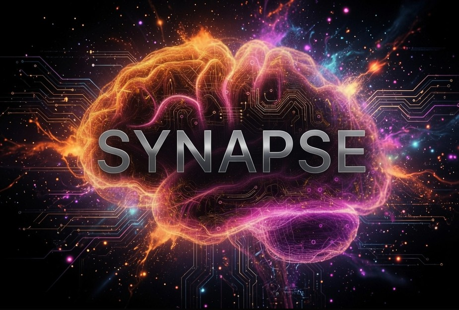

<p align="center">
  
</p>

# Synapse

Synapse is a webcam-first, local-first focus and fatigue support tool. It uses the local webcam to extract face landmarks on-device, estimates coarse attention signals in real time, and saves session summaries for review.

Synapse is pilot software. It is not a medical device, lie detector, emotion oracle, productivity scoring system, or employee discipline tool.

## What It Does

- Runs webcam processing locally with MediaPipe and OpenCV.
- Guides each user through onboarding: attention calibration plus an optional expression profile.
- Monitors live sessions for engagement, fatigue, tension, positivity, distraction, and broad attention state.
- Saves local CSV logs, alert logs, and text reports for review.
- Replays saved monitor sessions for debriefing and quality checks.

Raw webcam video is not saved by Synapse. See `docs/privacy.md` before any pilot use.

## Setup

Use **Python 3.11 or 3.12** on Windows with a working webcam. Do not use the latest Python (3.13+) or older releases such as 3.7 — `mediapipe==0.10.21` only ships wheels for 3.11–3.12.

### Quick start (share with pilots)

From the Synapse folder in PowerShell, run once:

```powershell
.\scripts\setup_windows.ps1
```

That installs dependencies and creates a **Synapse** icon on the desktop. Double-click it to open the launcher window. Choose **First Run** the first time.

No PowerShell? Double-click `Launch Synapse.bat` after setup. If dependencies are missing, the batch file will tell you to run `setup_windows.ps1`.

### Manual install

Check your environment before installing:

```powershell
.\scripts\check_python.ps1
```

Recommended install:

```powershell
py -3.11 -m venv .venv
.\.venv\Scripts\Activate.ps1
python -m pip install --upgrade pip
pip install -r requirements.txt
```

Optional tray and packaging dependencies:

```powershell
pip install -r requirements-dev.txt
```

If you only want to run Synapse (no Python setup), use `Synapse.exe` from a GitHub Release — see `docs/windows_install.md`.

### Install troubleshooting

| Symptom | Likely cause | Fix |
| --- | --- | --- |
| `No matching distribution found for mediapipe` | Python 3.13+ (or very old Python) | Install Python 3.11, recreate `.venv`, rerun `check_python.ps1` |
| Install hangs or fails on `mediapipe` after downgrading to 3.7 | Wrong direction — 3.7 is unsupported | Use 3.11 or 3.12 instead |
| `ImportError` / DLL load failed on Windows | Missing MSVC runtime | Install [Visual C++ Redistributable](https://learn.microsoft.com/en-us/cpp/windows/latest-supported-vc-redist) (x64) |
| `numpy` version conflict | NumPy 2.x pulled in by another package | Stay in a fresh venv; `requirements.txt` pins `numpy<2` |

More detail: `docs/known_issues.md`.

## Launcher Commands

Run commands from the repository root:

```powershell
python synapse_launcher.py onboard
python synapse_launcher.py monitor
python synapse_launcher.py monitor --fullscreen
python synapse_launcher.py showcase
python synapse_launcher.py showcase --fullscreen
python synapse_launcher.py replay "%LOCALAPPDATA%\Synapse\sessions\monitor_YYYYMMDD_HHMMSS.csv"
python synapse_launcher.py --tray
```

`onboard` records privacy consent, then captures calibration values and an expression profile. `monitor` starts a live webcam session and writes logs/reports. `showcase` runs the elite landmark shell and flight HUD for demos (no session logging). `replay` opens a saved session CSV; pass the CSV path explicitly for app-data sessions. Press `q` to quit a camera window and `f` to toggle fullscreen where supported.

## Local Data

On Windows, Synapse stores user data under:

```text
%LOCALAPPDATA%\Synapse
```

Expected contents:

- `config\privacy_consent.json`
- `config\calibration.json`
- `config\emotion_profile.json`
- `config\settings.json`
- `sessions\monitor_*.csv`
- `sessions\monitor_*.alerts.csv`
- `sessions\monitor_*.report.txt`

By default, monitor reports may also be copied to the Desktop as `Synapse_Report_*.txt`.

## Pilot Workflow

Use the no-payment pilot process in `docs/pilot_guide.md` until the software quality gate is met.

1. Explain consent and limitations.
2. Run `python synapse_launcher.py onboard`.
3. Run a short camera/environment check.
4. Run `python synapse_launcher.py monitor`.
5. Stop with `q`, review the generated report, and replay the session if needed.

## Build

For a smoke-test Windows executable, install dev dependencies and run the checked-in build script:

```powershell
pip install -r requirements-dev.txt
.\build.ps1
.\scripts\verify_release.ps1
```

Pilot install instructions for non-developers are in `docs/windows_install.md`.

Verify the build with `docs/release_checklist.md` before sharing it with pilot users.

## Documentation

- `docs/privacy.md` - privacy model, saved data, deletion/export controls, consent language.
- `docs/pilot_guide.md` - 5-person no-payment pilot workflow.
- `docs/release_checklist.md` - Windows release verification checklist.
- `docs/known_issues.md` - current limitations and webcam constraints.
- `docs/positioning.md` - approved positioning and prohibited claims.
- `docs/monetization_gate.md` - no-billing rule until the quality gate is proven.
